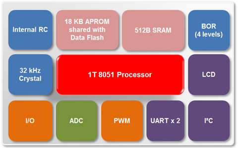

# [N76E616](https://github.com/SoCXin/N76E616)

* [nuvoton](http://www.nuvoton.com.cn/)：[8051](https://github.com/SoCXin/8051)
* [Level](https://github.com/SoCXin/Level)：16MHz

## [简介](http://www.SoC.Xin/N76E616)

[N76E616](https://www.nuvoton.com.cn/products/microcontrollers/8bit-8051-mcus/low-pin-count-8051-series/n76e616/?tab=1) 是新唐高速1T 8051 单片机产品，18 KB Flash ROM、1 KB SRAM，在20pin封装下提供高达18根I/O脚位；周边包含双串口、SPI、I²C、6通道PWM输出；内建优于同类产品之 < 2% 误差之高精确度16 MHz RC晶振与高分辨率8通道12位ADC。

### 关键特性

* 2.4V - 5.5V宽工作电压
* 7KV ESD/4KV EFT
* 8ch*12bit ADC

### [资源收录](https://github.com/SoCXin/N76E616)

* [参考文档](docs/)
* [参考资源](src/)
* [参考工程](project/)

### [选型建议](https://github.com/SoCXin)

[N76E616](https://github.com/SoCXin/N76E616) 是 [N76E003](https://github.com/SoCXin/N76E003) 的有力补充，提供了LQFP48 和 LQFP44两种封装。

###  [探索芯世界 www.SoC.xin](http://www.SoC.Xin)
